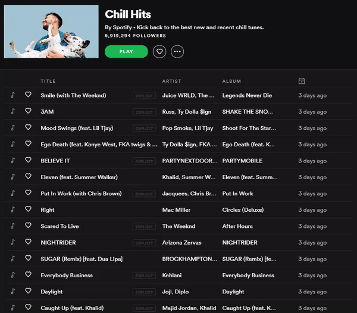

# Spotify to Youtube Instrumental

This script will take spotify tracks and search youtube for the instrumental versions of those tracks. The links to the instrumental versions can be found in instrumentals.txt.
Put the spotify links in songs.txt with this format: https://open.spotify.com/track/65ija1Fx0j053dmfhejrJr followed by a new line.
No API key required! The only thing the script needs from you are the spotify links in songs.txt.

Click one song on spotify, then hold shift and click another song. This will select all of the songs including and inbetween the two songs that you clicked.
Then, copy the links of the selected songs.